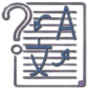

  

<h1 align="center">Noeme</h1>

Noeme does more than just give a simple definition-it provides a deep, contextual explanation of a word, including its:

* Pronunciation(how it's spoke)

* Meanings(the basic definition and advanced meanings of different parts of speech)

* Sample sentences(how it's used in context)

#### For development

> As a Rust crate

See: [https://crates.io/crates/noeme](https://crates.io/crates/noeme)

#### Built-in applications

> As a Chrome extension

> Working in progress!
